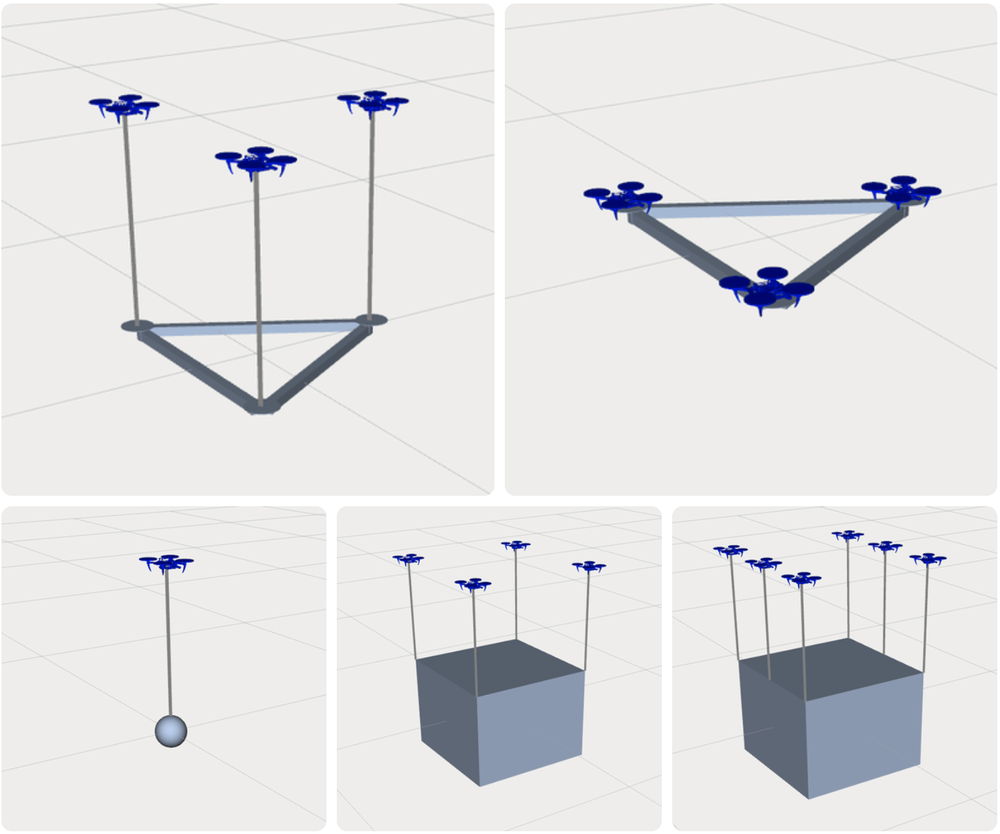
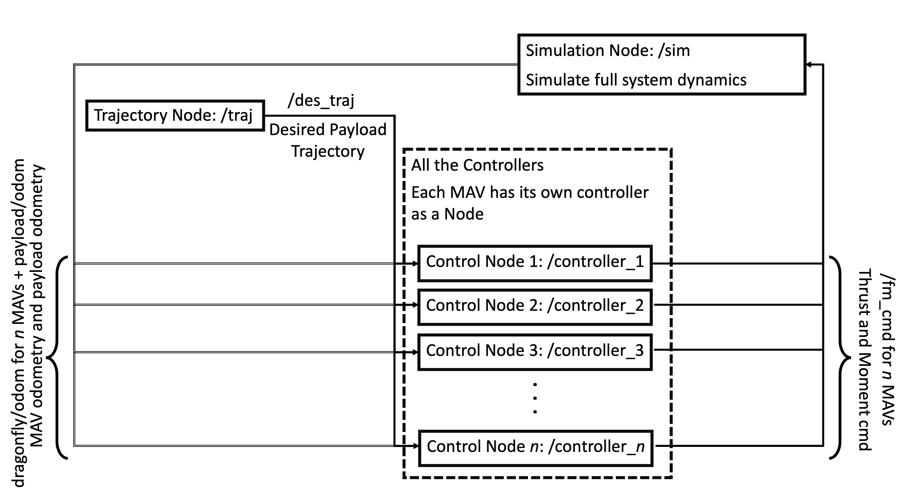

# RotorTM
An Aerial Transportation and Manipulation Simulator for Research and Education

## License
Please be aware that this code was originally implemented for research purposes and may be subject to changes and any fitness for a particular purpose is disclaimed. To inquire about commercial licenses, please contact Guanrui Li (lguanrui@nyu.edu), Xinyang Liu (liuxy@nyu.edu) and Prof. Giuseppe Loianno (loiannog@nyu.edu).
```
    This program is free software: you can redistribute it and/or modify
    it under the terms of the GNU General Public License as published by
    the Free Software Foundation, either version 3 of the License, or
    (at your option) any later version.

    This program is distributed in the hope that it will be useful,
    but WITHOUT ANY WARRANTY; without even the implied warranty of
    MERCHANTABILITY or FITNESS FOR A PARTICULAR PURPOSE.  See the
    GNU General Public License for more details.

    You should have received a copy of the GNU General Public License
    along with this program.  If not, see <https://www.gnu.org/licenses/>.
    
```
## Citation
If you publish a paper with our simulator, please cite our paper: 
```
@article{rotortm2022,
  doi = {10.48550/ARXIV.2205.05140}, 
  url = {https://arxiv.org/abs/2205.05140},
  author = {Li, Guanrui and Liu, Xinyang and Loianno, Giuseppe},
  title = {RotorTM: A Flexible Simulator for Aerial Transportation and Manipulation}}
 ```
## Overview
#### Description
RotorTM is an aerial transportation and manipulation simulator of MAVs with different payloads and passive connection mechanisms. It incorporates full system
dynamics as well as planning, and control algorithms for aerial transportation and manipulation. Furthermore, it includes a hybrid model accounting for the transient hybrid dynamics for aerial systems with cable suspended load to mimic real-world systems. It also provides flexible interfaces to planning and control software modules for the users. 

If you have any questions regarding the repo or how to use the simulator please feel free to post questions in the Issues. 



**Developer: Guanrui Li, Xinyang Liu<br />
Affiliation: [NYU ARPL](https://wp.nyu.edu/arpl/)<br />
Maintainer: Guanrui Li (lguanrui@nyu.edu), Xinyang Liu (liuxy@nyu.edu)<br />**

## ROS Organization
The ROS Organization is shown in the figure below. 

The table below also summarized the publication and subscription scheme. `#` is used to denote MAV number.
|Name|Description|Publications|Subscriptions|Services|
|---|---|---|---|---|
|`/controller_#`|Control MAV(s) to follow desired trajectory|`/controller_#/dragonfly#/fm_cmd`|`/dragonfly#/odom`
||||`/payload/des_traj`|
||||`/payload/odom`|
|`/sim`|Simulate full system dynamics and publish all relevant Odometries for payload and MAV(s)|`/dragonfly#/odom`|`/controller_#/dragonfly#/fm_cmd`
|||`/payload/odom`|
|`/traj`|Compute and publish the payload desired trajectory|`/payload/des_traj`||`/traj_generator/Circle`
|||||`/traj_generator/Line`
|||||`/traj_generator/Min_Derivative_Line`

## Parameters Files
These files are used to set properties of the MAV(s).
|Name|Description|
|---|---|
|`UAV Params`|Basic UAV parameters like |
|`Payload Params`|Basic payload parameters like mass, moment of inertia etc.|
|`UAV Controller Params`|UAV controller parameters|
|`Payload Controller Params`|Payload controller parameters|
|`Attach Mechanism Params`|Attach mechanism parameters|

## Dependencies and Installation
The RotorTM package is dependent on `Python 3.8` and `ROS Noetic/Melodic`. Please ensure `Python 3.8` as other python versions may lead to build and import errors. Python packages including `numpy`, `scipy`, and `cvxopt` should be installed with `pip install`. 
```
$ pip install numpy==1.22.1
$ pip install scipy==1.8.0
$ pip install cvxopt==1.2.7
```


After installation of necessary packages, clone the repo and `catkin_make` the ROS workspace. Source the `setup.bash` file inside the devel folder.

```
$ cd /path/to/your/workspace/src
$ git clone --branch Python/ROS https://github.com/arplaboratory/RotorTM.git
$ catkin_make
$ source ~/path/to/your/workspace/devel/setup.bash
```

##  Running
### Switching Off Hybrid Dynamics
Before initialization, check PC's system info. If the processor is weaker than Intel® Core™ i7 (or equivalent), it is recommended to initialize the simulation with hybrid dynamics turned off. To turn it off, use command window to set `/hybrid_switch` rosparam to `False` after start `roscore`:
```
$ rosparam set /hybrid_switch False
```
Now proceed with 'Initialize Simulation' secition below. The hybrid dynamics will be turned off and a lighter integrator will be used. To turn on hybrid dynamics, set `/hybrid_switch` rosparam to `True` and relaunch the simulator.  

By default, hybrid dynamics will be included in the simulator and a heavier integrator will be used to have better accuracy. If user wishes to include hybrid dynamics, this section can be ignored.

### Initialize Simulation
Directly call the `.launch`  file using `roslaunch` command after `roscore` is started:
```
$ source ~/path/to/your/workspace/devel/setup.bash
$ roslaunch rotor_tm editable_launch.launch
```
By default, the `editable_launch.launch` is set to initialize the 3 MAVs cable suspended triangular payload. Directly editing the `editable_launch.launch` allows various scenarios to be initialized. A Comprehensive list of all possible scenarios is provided as comments inside `editable_launch.launch`. Please refer to that in the `editable_launch.launch`.
### Start simulation
After calling the launch file, the MAV(s) and payload is hovering at a predetermined initial location. To start simulation, desired trajectory needs to be generated by `/traj` node. `/traj` node has been set up with three ROS services corresponding to three possible trajectory generators. 
|Service|Description|
|---|---|
|`/traj_generator/Line`|line trajectory generator
|`/traj_generator/Circle`|circular trajectory generator|unlimited 
|`/traj_generator/Min_Derivative_Line`|minimum derivative trajectory generator

The location of service call definition is `RotorTM/rotor_tm_traj/srv`. Directly calling the services would start the simulation by activating the publication of `payload/des_traj`.

Here is an example of generating a circular trajectory with radius = 1.0 meter , period = 10 seconds, and duration = 10 seconds:
```
$ rosservice call /traj_generator/Circle 1.0 10.0 10.0
```
Another example of generating a line trajectory with from point [0,0,0] to [1,1,1]:
```
$ rosservice call /traj_generator/Line "path:
  - x: 1.0
    y: 1.0
    z: 1.0"
```
## Trajectory Generator
### Line Trajectory Generator
The line trajectory generator will generate a sequence of points connecting the given waypoint. The path simply connects all the points with straight lines. 

### Circular Trajectory Generator
The circular trajectory generator will generate a circular trajectory such that it will  
 1. ramp up to a constant speed
 2. run several cycles of circles ( depending on the period and duration)
 3. ramp down to zero speed. 

Here are the parameters to set for generating the circular trajectory:
|Name|Chosen Files|
|---|---|
|`Radius`|`The radius of the circular trajectory`|
|`Period`|`The period time of finishing one circle`|
|`Duration`|`The total time of the circular trajectory`|

### Minimum Derivative Trajectory Generator
The minimum_derivative trajectory generator will generate a trajectory that goes through a given path. The path will avoid sharp turning and sudden change of directions.

A corridor constraint is also provided for the minimum derivative trajectory generator. The `create_option.py` in `rotor_tm_traj.traj.Optimization` can be modified to activate/deactivate this constraint. The width of the corridor can also be changed. 

To activate corridor constraint, set `self.cor_constraint` to `True`.

To deactivate corridor constraint, set `self.cor_constraint` to `True`.

To set width of the corridor, set `self.cor_wid` to a float.

Currently, the corridor constraint is deactivated.
